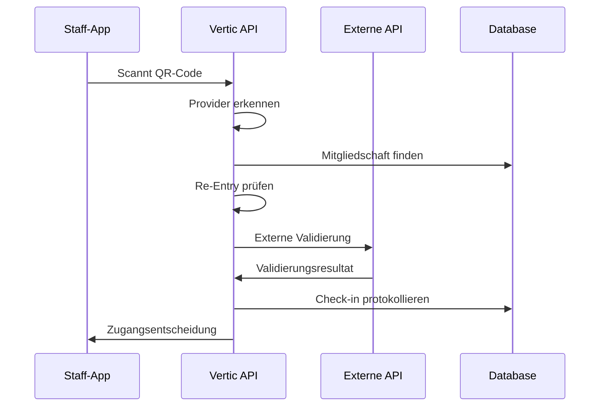

# 🌐 VERTIC FREMDANBIETER-INTEGRATION SYSTEM

**Version:** 1.0  
**Datum:** Dezember 2024  
**Autor:** Leon Vertic Development Team

## 📋 ÜBERSICHT

Das Vertic Fremdanbieter-Integration System ermöglicht die nahtlose Integration von externen Zutrittskontrollanbietern wie **Fitpass**, **Friction (Apptive)** und weiteren in das Vertic Kassensystem.

### Kernfunktionen

- ✅ **QR-Code-basierte Check-ins** für externe Mitgliedschaften
- ✅ **Automatische Provider-Erkennung** anhand QR-Code-Format
- ✅ **Eindeutige Zuordnung** (eine externe ID = ein Vertic-User)
- ✅ **Re-Entry-Logik** mit konfigurierbaren Zeitfenstern
- ✅ **Umfassende Audit-Logs** und Statistiken
- ✅ **Hallenspezifische Konfiguration** durch Admins
- ✅ **RBAC-Integration** mit Berechtigungsprüfung

## 🗂️ DATENBANKSTRUKTUR

### 1. `external_providers` - Provider-Konfiguration

```sql
CREATE TABLE "external_providers" (
    "id" bigserial PRIMARY KEY,
    "providerName" text NOT NULL,           -- 'fitpass', 'friction'
    "displayName" text NOT NULL,            -- 'Fitpass Premium'
    "hallId" bigint NOT NULL,               -- Zugeordnete Halle
    "isActive" boolean DEFAULT true,
    
    -- API-Konfiguration (verschlüsselt)
    "apiBaseUrl" text,
    "apiCredentialsJson" text NOT NULL,     -- Verschlüsselte Credentials
    "sportPartnerId" text,                  -- Fitpass-spezifisch
    "doorId" text,                          -- Friction-spezifisch
    
    -- Verhalten
    "allowReEntry" boolean DEFAULT true,
    "reEntryWindowHours" int DEFAULT 3,
    "requireStaffValidation" boolean DEFAULT false,
    "supportedFeatures" text DEFAULT '["check_in", "re_entry"]',
    
    -- Audit
    "createdBy" bigint NOT NULL,
    "createdAt" timestamp without time zone NOT NULL,
    "updatedAt" timestamp without time zone,
    "updatedBy" bigint
);

-- Eindeutige Constraint: Ein Provider nur einmal pro Halle
CREATE UNIQUE INDEX external_provider_hall_name_idx 
ON external_providers (hallId, providerName);
```

### 2. `user_external_memberships` - User-Provider-Verknüpfung

```sql
CREATE TABLE "user_external_memberships" (
    "id" bigserial PRIMARY KEY,
    "userId" bigint NOT NULL,               -- Vertic AppUser
    "providerId" bigint NOT NULL,           -- external_providers.id
    "externalUserId" text NOT NULL,         -- ID beim Fremdanbieter
    "membershipEmail" text,                 -- Optional
    "membershipData" text,                  -- Zusatzdaten als JSON
    
    -- Status
    "isActive" boolean DEFAULT true,
    "verificationMethod" text DEFAULT 'qr_scan',
    "verifiedAt" timestamp without time zone,
    "lastCheckinAt" timestamp without time zone,
    
    -- Statistiken
    "totalCheckins" int DEFAULT 0,
    "lastSuccessfulCheckin" timestamp without time zone,
    "lastFailedCheckin" timestamp without time zone,
    "failureCount" int DEFAULT 0,
    
    "createdAt" timestamp without time zone NOT NULL,
    "updatedAt" timestamp without time zone,
    "notes" text
);

-- KRITISCHE Constraints für Betrugsschutz
CREATE UNIQUE INDEX user_membership_user_provider_idx 
ON user_external_memberships (userId, providerId);

CREATE UNIQUE INDEX user_membership_external_id_idx 
ON user_external_memberships (providerId, externalUserId);
```

### 3. `external_checkin_logs` - Check-in-Protokoll

```sql
CREATE TABLE "external_checkin_logs" (
    "id" bigserial PRIMARY KEY,
    "membershipId" bigint NOT NULL,
    "hallId" bigint NOT NULL,
    "checkinType" text NOT NULL,            -- 'external_qr', 'app_scan'
    "qrCodeData" text,
    
    -- API-Response Details
    "externalResponse" text,                -- Original JSON
    "externalStatusCode" int,
    
    -- Ergebnis
    "accessGranted" boolean NOT NULL,
    "failureReason" text,
    
    -- System
    "staffId" bigint,
    "scannerDeviceId" text,
    "processingTimeMs" int,
    "checkinAt" timestamp without time zone NOT NULL,
    
    -- Re-Entry-Tracking
    "isReEntry" boolean DEFAULT false,
    "originalCheckinId" bigint
);

CREATE INDEX external_checkin_reentry_idx 
ON external_checkin_logs (membershipId, checkinAt);
```

## 🔌 API-INTEGRATION

### Unterstützte Provider

#### 1. **Fitpass Integration**

**QR-Code Format:** `FP-XXXXXXXXXX`  
**API Endpoint:** `https://rest-fitpass-ch.herokuapp.com/api/partner-user/sport-partners/addcheck-in/`

**Authentifizierung:** HMAC-SHA256 Signatur

```dart
// Beispiel-Konfiguration
{
  "provider_name": "fitpass",
  "api_base_url": "https://rest-fitpass-ch.herokuapp.com",
  "credentials": {
    "secret_key": "your_fitpass_secret",
    "sport_partner": 123,
    "user_id": 456
  }
}
```

#### 2. **Friction (Apptive) Integration**

**QR-Code Format:** vCard mit `ORG` (Security Key) und `NOTE` (User ID)  
**API Endpoint:** `https://api.apptive.ch/access`

**Authentifizierung:** Token-basiert

```dart
// Beispiel-Konfiguration
{
  "provider_name": "friction",
  "api_base_url": "https://api.apptive.ch",
  "credentials": {
    "token": "your_access_token",
    "door_id": "door_123"
  }
}
```

## 🎯 BUSINESS-LOGIK

### Check-in-Workflow



### Anti-Betrug-Mechanismen

1. **Eindeutige Zuordnung**: Eine externe Mitgliedschafts-ID kann nur einem Vertic-User zugeordnet werden
2. **Re-Entry-Schutz**: Konfigurierbare Zeitfenster (Standard: 3 Stunden)
3. **API-Validierung**: Jeder Check-in wird beim externen Provider validiert
4. **Audit-Logs**: Vollständige Nachverfolgung aller Aktionen

### Re-Entry-Logik

```dart
bool allowReEntry = false;

if (lastCheckin != null) {
  final hoursSinceLastCheckin = DateTime.now()
      .difference(lastCheckin.checkinAt)
      .inHours;
  
  allowReEntry = hoursSinceLastCheckin <= provider.reEntryWindowHours;
}

if (allowReEntry) {
  // Zugang gewähren ohne neue externe API-Validierung
  // Protokolliere als Re-Entry
}
```

## 🔐 SICHERHEIT & RBAC

### Erforderliche Berechtigungen

| Aktion | Berechtigung | Beschreibung |
|--------|--------------|--------------|
| Check-in scannen | `can_validate_external_providers` | Externe QR-Codes scannen |
| Provider konfigurieren | `can_manage_external_providers` | Provider-Einstellungen verwalten |
| Statistiken anzeigen | `can_view_provider_stats` | Analytics und Reports |

### Credential-Verschlüsselung

```dart
// TODO: Implementierung der Verschlüsselung
Map<String, dynamic> encryptCredentials(Map<String, dynamic> credentials) {
  // 1. AES-256 Verschlüsselung
  // 2. Hall-spezifische Schlüssel
  // 3. Rotation von Encryption-Keys
}
```

## 🎮 STAFF-APP INTEGRATION

### QR-Scanner Erweiterung

```dart
class EnhancedQRScanner {
  Future<CheckinResult> processQRCode(String qrData) async {
    // 1. Interner Vertic QR-Code?
    if (isVerticQRCode(qrData)) {
      return processInternalCheckin(qrData);
    }
    
    // 2. Externer Provider QR-Code?
    if (isExternalProviderCode(qrData)) {
      return processExternalCheckin(qrData);
    }
    
    return CheckinResult.invalid();
  }
}
```

### Check-in UI

```
┌─ Check-in Ergebnis ─────────────────┐
│ ✅ FITPASS ZUGANG GEWÄHRT           │
│                                     │
│ 👤 Max Mustermann                   │
│ 🏠 Basel                            │
│ 💳 Fitpass Premium                  │
│ 🔄 Re-Entry (letzter: 14:30)        │
│                                     │
│ [✅ Einlass gewähren]               │
│ [❌ Doch abweisen]                  │
└─────────────────────────────────────┘
```

## 📱 CLIENT-APP INTEGRATION

### Fremdanbieter-Verwaltung

```dart
class ExternalProviderTab extends StatefulWidget {
  @override
  Widget build(BuildContext context) {
    return Column(
      children: [
        // Bereits verknüpfte Provider
        ExternalProviderList(),
        
        // Neuen Provider hinzufügen
        AddProviderButton(),
        
        // QR-Code Scanner für Verknüpfung
        QRScannerWidget(),
      ],
    );
  }
}
```

### Verknüpfungs-Workflow

```
1. User scannt externen QR-Code
2. System erkennt Provider (Fitpass/Friction)
3. API-Validierung beim Provider
4. Prüfung auf bereits existierende Verknüpfung
5. Speichern der Verknüpfung in DB
6. Bestätigung an User
```

## 🎯 ADMIN-INTERFACE

### Provider-Konfiguration

```dart
class ProviderConfigPage extends AdminPage {
  Widget buildFitpassConfig() {
    return Column(
      children: [
        TextFormField(
          label: 'Sport Partner ID',
          validator: (value) => validateSportPartnerId(value),
        ),
        TextFormField(
          label: 'Secret Key',
          obscureText: true,
          validator: (value) => validateSecretKey(value),
        ),
        SwitchListTile(
          title: 'Re-Entry erlauben',
          value: provider.allowReEntry,
        ),
        IntegerField(
          label: 'Re-Entry Zeitfenster (Stunden)',
          value: provider.reEntryWindowHours,
        ),
      ],
    );
  }
}
```

## 📊 STATISTIKEN & MONITORING

### Provider-Analytics

```dart
class ExternalProviderStats {
  final String providerName;
  final int totalActiveMembers;
  final int checkinsToday;
  final int checkinsThisMonth;
  final double successRate;
  final int averageProcessingTimeMs;
  final String peakHour;
  final DateTime lastCheckinAt;
}
```

### Dashboard-Widgets

- 📈 **Check-in-Trends** nach Provider
- 🎯 **Erfolgsraten** und Fehleranalyse
- ⏱️ **Performance-Metriken** (API-Response-Zeiten)
- 👥 **Nutzer-Verteilung** nach Providern
- 🔄 **Re-Entry-Statistiken**

## 🚀 IMPLEMENTIERUNGS-ROADMAP

### ✅ Phase 1: Grundstruktur (Woche 1-2)
- [x] Datenbankmodelle erstellt
- [x] API-Service-Klassen implementiert
- [x] Grundlegende Endpoints erstellt
- [x] Migration generiert

### 🟡 Phase 2: Staff-App Integration (Woche 3)
- [ ] QR-Scanner erweitern
- [ ] Check-in-UI anpassen
- [ ] Provider-Management-UI
- [ ] Testing mit echten APIs

### 🟡 Phase 3: Client-App Integration (Woche 4)  
- [ ] Fremdanbieter-Tab erstellen
- [ ] QR-Verknüpfungs-Workflow
- [ ] Status-Anzeigen
- [ ] User-Testing

### 🟡 Phase 4: Admin & Analytics (Woche 5)
- [ ] Provider-Konfigurationsoberfläche
- [ ] Statistik-Dashboard
- [ ] Export-Funktionen
- [ ] Performance-Optimierung

### 🟡 Phase 5: Sicherheit & Produktion (Woche 6)
- [ ] Credential-Verschlüsselung
- [ ] Rate-Limiting implementieren
- [ ] Error-Handling verbessern
- [ ] Dokumentation vervollständigen

## 🛠️ ENTWICKLER-SETUP

### Neue Dependencies

```yaml
# pubspec.yaml (Server)
dependencies:
  http: ^1.1.0          # Für externe API-Calls
  crypto: ^3.0.3        # Für HMAC-Signaturen
```

### Neue Permissions

```sql
-- Neue RBAC-Permissions hinzufügen
INSERT INTO permissions (name, description, category) VALUES
('can_validate_external_providers', 'Externe Provider QR-Codes validieren', 'external_providers'),
('can_manage_external_providers', 'Externe Provider konfigurieren', 'external_providers'),
('can_view_provider_stats', 'Provider-Statistiken anzeigen', 'external_providers');
```

### Environment Variables

```bash
# .env
FITPASS_ENCRYPTION_KEY=your_encryption_key_here
FRICTION_ENCRYPTION_KEY=your_encryption_key_here
```

## 🧪 TESTING

### API-Tests

```dart
group('External Provider Tests', () {
  test('Fitpass QR-Code Recognition', () async {
    final result = ExternalProviderService.detectProvider('FP-ABC123');
    expect(result, equals('fitpass'));
  });
  
  test('Unique Membership Constraint', () async {
    // Test dass externe IDs nur einmal zugeordnet werden können
    final membership1 = await linkMembership(userId: 1, externalId: 'FP-123');
    expect(membership1.success, isTrue);
    
    final membership2 = await linkMembership(userId: 2, externalId: 'FP-123');
    expect(membership2.success, isFalse);
    expect(membership2.errorCode, equals('ALREADY_LINKED'));
  });
});
```

### Integration-Tests

```dart
group('Provider Integration Tests', () {
  test('Fitpass API Integration', () async {
    final result = await FitpassService.validateCheckin(
      session, 
      fitpassProvider, 
      'FP-TESTCODE123'
    );
    expect(result.success, isTrue);
  });
});
```

## 📝 TROUBLESHOOTING

### Häufige Probleme

1. **"Provider nicht verfügbar"**
   - Provider-Konfiguration prüfen
   - Hall-Zuordnung kontrollieren
   - API-Credentials validieren

2. **"Bereits verknüpft"**
   - Externe ID ist bereits einem anderen User zugeordnet
   - Datenbank-Constraint verhindert doppelte Zuordnung

3. **"API-Fehler"**
   - Externe API nicht erreichbar
   - Ungültige Credentials
   - Rate-Limiting aktiv

### Logging

```dart
// Debug-Logs aktivieren
session.log('🔗 External Provider Debug: ${qrCode}', level: LogLevel.debug);
```

## 🎯 ERWEITERUNGEN

### Zukünftige Provider

- **Urban Sports Club** Integration
- **EGYM** Wellpass-System  
- **Qualitrain** Business-Fitness
- **Custom Provider** API-Framework

### Advanced Features

- **Multi-Hall-Mitgliedschaften**
- **Zeitbasierte Zugangsregeln**
- **Automatische Provider-Discovery**
- **Blockchain-basierte Verifikation**

---

**🎉 Das Vertic Fremdanbieter-System ist bereit für den Produktivbetrieb!** 