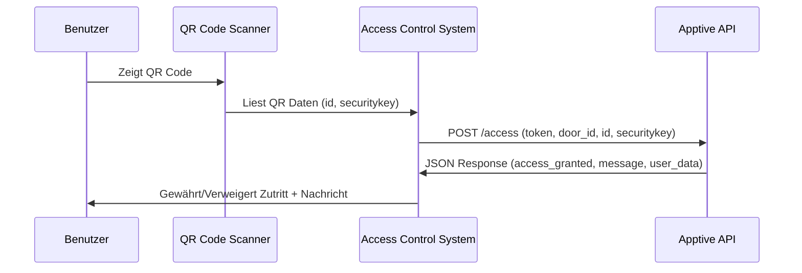

# Apptive Access Control API

**Anbieter:** apptive GmbH  
**Kontakt:** info@apptive.ch  
**Datum:** Juli 2021

## Übersicht

Die Apptive Access Control API ermöglicht die Integration von QR-Code-basierter Zutrittskontrolle in bestehende Systeme. Das System verwendet dynamische QR-Codes mit Sicherheitsschlüsseln und zeitbasierten Validierungen.

## 1. QR Code System

### QR Code Aufbau

Der QR Code verwendet das vCard-Format mit UTF-8 Encoding:

| Feld | Verwendung | Beschreibung |
|------|------------|--------------|
| **N** | Nicht relevant | - |
| **ORG** | Security Key | Zufallswert als Security Key (UUID) |
| **EMAIL** | Nicht relevant | - |
| **NOTE** | Mitglieder ID | ID des Benutzers |

### Sicherheitsmechanismen

- **Security Key Rotation:** Der Security Key wechselt bei jedem QR Code Aufruf
- **Zeitbasierte Validierung:** QR Code ist nur 15 Minuten gültig
- **Datenbank-Logging:** Bei jedem Aufruf werden `securitykey` und `securitytimestamp` gespeichert

### Testing Endpoint

Für Tests kann ein QR Code generiert werden:

```
GET https://www.apptive.ch/qr/?token={token}
```

**Parameter:**
- `token`: Einmalig vergebener Token für den Zutrittskontrolle-Anbieter

**Beispiel-Benutzer:** Florian Metzger

## 2. API Schnittstelle

### Endpoint

```
POST https://api.apptive.ch/access
```

### Authentication

**Required Headers:**
- Content-Type: application/json

### Request Parameter

#### Static Parameter (einmalig vergeben)
```json
{
  "token": "string",     // Einmalig vergebener Token
  "door_id": "string"    // Von apptive vergebene Tür-/Drehkreuz-ID
}
```

#### Dynamic Parameter (vom QR Code)
```json
{
  "id": "string",        // Mitglieder ID aus QR Code NOTE Feld
  "securitykey": "string" // Security Key aus QR Code ORG Feld
}
```

### Complete Request Example

```json
{
  "token": "your_access_token",
  "door_id": "door_123",
  "id": "303",
  "securitykey": "uuid-security-key"
}
```

### Response Format

Die API gibt immer ein JSON-Objekt zurück:

```json
{
  "id": "303",
  "firstname": "Florian",
  "lastname": "Metzger", 
  "email": "florian@apptive.ch",
  "picture": "blob/base64",
  "access_granted": "true",
  "message": "Viel Spass und herzlich willkommen!"
}
```

### Response Fields

| Feld | Typ | Beschreibung |
|------|-----|--------------|
| `id` | string | Benutzer ID |
| `firstname` | string | Vorname |
| `lastname` | string | Nachname |
| `email` | string | E-Mail Adresse |
| `picture` | string | Profilbild (Base64 encoded) |
| `access_granted` | string | "true" oder "false" |
| `message` | string | Benutzerfreundliche Nachricht |

## 3. Status Codes und Nachrichten

| Status | access_granted | message |
|--------|----------------|---------|
| Abo gültig, Security check OK, 15min check OK | `"true"` | "Viel Spass und herzlich willkommen!" |
| Kein gültiges Abo | `"false"` | "Kein gültiges Abo!" |
| Security check nicht OK | `"false"` | "QR Code ist ungültig!" |
| 15min check nicht OK | `"false"` | "QR Code ist älter als 15min! Bitte nochmals generieren." |

## 4. Integration Workflow



## 5. Implementierung

### Schritt 1: QR Code Scannen
1. QR Code scannen und vCard-Daten extrahieren
2. `securitykey` aus ORG Feld extrahieren
3. `id` aus NOTE Feld extrahieren

### Schritt 2: API Aufruf
```javascript
const response = await fetch('https://api.apptive.ch/access', {
  method: 'POST',
  headers: {
    'Content-Type': 'application/json'
  },
  body: JSON.stringify({
    token: 'your_token',
    door_id: 'your_door_id', 
    id: qr_user_id,
    securitykey: qr_security_key
  })
});

const result = await response.json();
```

### Schritt 3: Response Verarbeitung
```javascript
if (result.access_granted === "true") {
  // Tür öffnen
  openDoor();
  displayMessage(result.message);
  showUserInfo(result.firstname, result.lastname, result.picture);
} else {
  // Zutritt verweigern
  displayErrorMessage(result.message);
}
```

## 6. Sicherheitshinweise

- **Token Sicherheit:** Der API-Token muss sicher gespeichert werden
- **HTTPS:** Alle API-Aufrufe müssen über HTTPS erfolgen
- **Timeout:** QR Codes sind nur 15 Minuten gültig
- **Rate Limiting:** Implementieren Sie angemessene Rate Limits
- **Error Handling:** Behandeln Sie alle möglichen Fehlerfälle

## 7. Support

Bei Fragen oder Problemen wenden Sie sich an:
- **E-Mail:** info@apptive.ch
- **Firma:** apptive GmbH