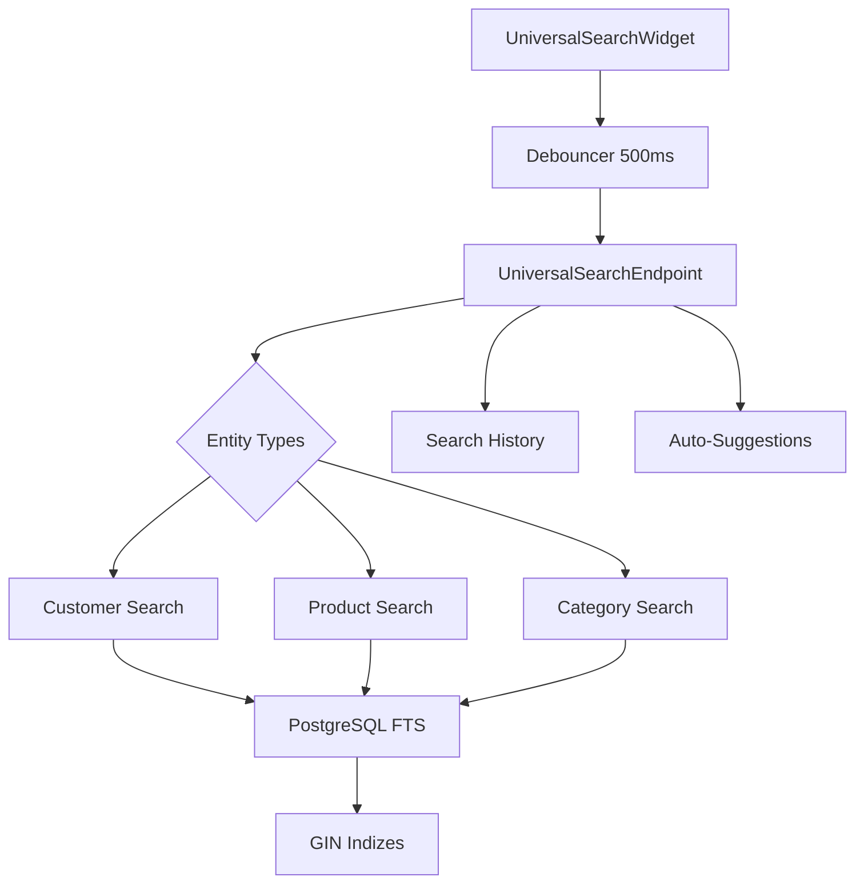

# 🔍 Universelle Suchfunktion - Implementierungsguide

## 🎯 **Überblick**

Die universelle Suchfunktion ermöglicht es Benutzern, gleichzeitig nach **Kunden**, **Produkten** und **Kategorien** zu suchen. Sie nutzt moderne PostgreSQL Full-Text Search und Flutter-Best-Practices für eine optimale Benutzererfahrung.

## ⚡ **Features**

### 🚀 **Backend (Serverpod + PostgreSQL)**
- **PostgreSQL Full-Text Search** mit deutschen Sprachregeln
- **GIN-Indizes** für maximale Performance
- **Trigram-Fuzzy-Matching** für Tippfehler-Toleranz
- **Relevanz-Ranking** mit `ts_rank`
- **Live-Prefix-Suche** für Auto-Complete
- **Suchhistorie** für Analytics und Vorschläge

### 📱 **Frontend (Flutter)**
- **Debounced Search** (500ms) für Performance
- **Auto-Complete** mit Live-Suggestions
- **Responsive UI** mit Material Design 3
- **Entity-spezifische Icons** und Farben
- **Highlight-Unterstützung** für Suchbegriffe
- **Animierte Übergänge** für bessere UX

## 🏗️ **Architektur**



## 📂 **Dateistruktur**

```
vertic_project/
├── vertic_server/
│   └── lib/src/
│       ├── models/
│       │   ├── search_result.spy.yaml
│       │   ├── search_request.spy.yaml
│       │   └── search_response.spy.yaml
│       └── endpoints/
│           └── universal_search_endpoint.dart
├── vertic_staff_app/
│   ├── lib/widgets/
│   │   └── universal_search_widget.dart
│   └── lib/pages/
│       └── universal_search_demo_page.dart
└── migrations/
    └── 20250719140000_universal_search_setup.sql
```

## 🛠️ **Setup-Anleitung**

### 1. **Database Migration ausführen**

```bash
# PostgreSQL-Migration anwenden
psql -d vertic_db -f migrations/20250719140000_universal_search_setup.sql
```

### 2. **Serverpod Modelle generieren**

```bash
cd vertic_server_server
dart run serverpod_cli generate
```

### 3. **Flutter Dependencies hinzufügen**

```yaml
# pubspec.yaml
dependencies:
  provider: ^6.1.1
  # ... andere dependencies
```

### 4. **Widget in App integrieren**

```dart
import '../widgets/universal_search_widget.dart';

// In deiner Seite:
UniversalSearchWidget(
  hintText: 'Kunden, Produkte, Kategorien suchen...',
  entityTypes: ['customer', 'product', 'category'], // Optional
  onResultSelected: (result) {
    // Handle selection
    print('Selected: ${result.title}');
  },
  onQueryChanged: (query) {
    // Optional: Track search queries
  },
)
```

## 📊 **Performance-Optimierungen**

### **Backend**
- **GIN-Indizes** für alle Suchfelder
- **Partielle Indizes** für aktive Einträge (`WHERE is_active = true`)
- **Trigram-Indizes** für Fuzzy-Matching
- **Query-Caching** durch PostgreSQL
- **Parallel Search** über alle Entity-Types

### **Frontend**
- **Debouncing (500ms)** verhindert übermäßige API-Calls
- **Virtualisierte Listen** für große Ergebnismengen
- **Caching** von Recent Searches
- **Optimistische UI-Updates**
- **Lazy Loading** für Paginierung

## 🎨 **UI/UX-Best-Practices**

### **Visuelles Design**
```dart
// Entity-spezifische Farben
switch (entityType) {
  case 'customer': return Colors.blue;     // 👥 Kunden
  case 'product':  return Colors.green;    // 🛒 Produkte  
  case 'category': return Colors.purple;   // 🏷️ Kategorien
}
```

### **Responsives Layout**
- **Adaptive Breite** je nach Bildschirmgröße
- **Scrollbare Ergebnislisten** mit max. Höhe
- **Touch-optimierte Tap-Targets** (min. 44px)
- **Accessibility-Support** mit Semantics

### **Animationen**
- **Fade-In** für Suchergebnisse (300ms)
- **Smooth Transitions** zwischen States
- **Loading-Indikatoren** für besseres Feedback

## 🔧 **Konfigurationsoptionen**

### **Backend-Konfiguration**

```dart
// SearchRequest-Parameter
final request = SearchRequest(
  query: 'suchbegriff',
  entityTypes: ['customer', 'product'],  // Filter nach Typen
  limit: 20,                             // Max. Ergebnisse
  offset: 0,                             // Pagination
  minRelevance: 0.1,                     // Min. Relevanz-Score
  includeHighlights: true,               // HTML-Highlights
  searchHistory: true,                   // In Historie speichern
);
```

### **Frontend-Konfiguration**

```dart
UniversalSearchWidget(
  hintText: 'Custom hint text',
  entityTypes: ['product'],              // Nur Produkte
  autofocus: true,                       // Auto-Focus
  width: 400,                            // Feste Breite
  onResultSelected: (result) => {},      // Selection Handler
  onQueryChanged: (query) => {},         // Query-Change Handler
)
```

## 📈 **Monitoring & Analytics**

### **Search History Tracking**
```sql
-- Top-Suchanfragen der letzten 30 Tage
SELECT query, COUNT(*) as searches, AVG(result_count) as avg_results
FROM search_history 
WHERE created_at >= NOW() - INTERVAL '30 days'
GROUP BY query
ORDER BY searches DESC
LIMIT 10;
```

### **Performance-Metriken**
- **Query-Zeit** (avg. <50ms für Full-Text Search)
- **Cache-Hit-Rate** für Suggestions
- **User-Engagement** mit Suchergebnissen
- **Conversion-Rate** (Suche → Auswahl)

## 🚀 **Erweiterte Features (Roadmap)**

### **Kurzfristig**
- [ ] **Barcode-Scanner** Integration
- [ ] **Voice Search** mit Speech-to-Text
- [ ] **Filter-Optionen** (Datum, Preis, etc.)
- [ ] **Saved Searches** für häufige Abfragen

### **Mittelfristig**  
- [ ] **Semantic Search** mit Embeddings
- [ ] **Auto-Complete** mit ML-Suggestions
- [ ] **Search-Analytics Dashboard**
- [ ] **A/B-Testing** für UI-Varianten

### **Langfristig**
- [ ] **ElasticSearch** Integration für Skalierung
- [ ] **Multi-Language** Support
- [ ] **Personalisierte Suchergebnisse**
- [ ] **Search-as-a-Service** für andere Apps

## 🐛 **Troubleshooting**

### **Häufige Probleme**

**1. Keine Suchergebnisse trotz vorhandener Daten**
```sql
-- Prüfe ob Indizes existieren
SELECT indexname, tablename FROM pg_indexes 
WHERE indexname LIKE '%fulltext%';

-- Regeneriere Indizes falls nötig
REINDEX INDEX idx_products_fulltext_german;
```

**2. Langsame Suchperformance**
```sql
-- Analysiere Query-Performance
EXPLAIN ANALYZE 
SELECT * FROM products 
WHERE to_tsvector('german', name) @@ to_tsquery('german', 'cola:*');
```

**3. Flutter Widget zeigt keine Ergebnisse**
```dart
// Debug-Ausgabe aktivieren
debugPrint('🔍 Search results: ${_searchResults.length}');
debugPrint('🔍 Current query: $_currentQuery');
```

### **Logging & Debugging**

```dart
// Backend-Logging
session.log('🔍 UniversalSearch: ${results.length} results in ${queryTime}ms');

// Frontend-Debugging  
if (kDebugMode) {
  print('Search performed: $query → ${results.length} results');
}
```

## 📚 **API-Referenz**

### **SearchResult Model**
```dart
class SearchResult {
  final String entityType;      // 'customer', 'product', 'category'
  final int entityId;           // Eindeutige ID
  final String title;           // Haupt-Anzeigename
  final String? subtitle;       // Zusatzinfo (Email, Preis, etc.)
  final String? description;    // Längere Beschreibung
  final double relevanceScore;  // 0.0 - 1.0 Relevanz
  final List<String> matchedFields;  // Gematchte Felder
  final String? highlightedText;     // HTML mit <mark> Tags
  // ... weitere Felder
}
```

### **UniversalSearchEndpoint Methods**
```dart
Future<SearchResponse> universalSearch(Session session, SearchRequest request);
```

## 🎯 **Best Practices**

### **Performance**
- ✅ Verwende **Debouncing** (min. 300ms)
- ✅ **Limitiere Ergebnisse** (max. 50 pro Query)
- ✅ **Cache häufige Suchanfragen**
- ✅ **Nutze Pagination** für große Datenmengen

### **UX-Design**
- ✅ **Instant Feedback** mit Loading-States
- ✅ **Empty States** für keine Ergebnisse
- ✅ **Error Handling** mit User-freundlichen Meldungen
- ✅ **Keyboard Shortcuts** (Escape zum Schließen)

### **Sicherheit**
- ✅ **Input Sanitization** gegen SQL-Injection
- ✅ **Rate Limiting** für API-Schutz  
- ✅ **Auth-Checks** für sensible Daten
- ✅ **Logging ohne PII** (keine Kundendaten in Logs)

---

**🚀 Mit dieser universellen Suchfunktion wird dein POS-System zu einem kraftvollen Tool, das Benutzern hilft, schnell und effizient alles zu finden, was sie benötigen!** 